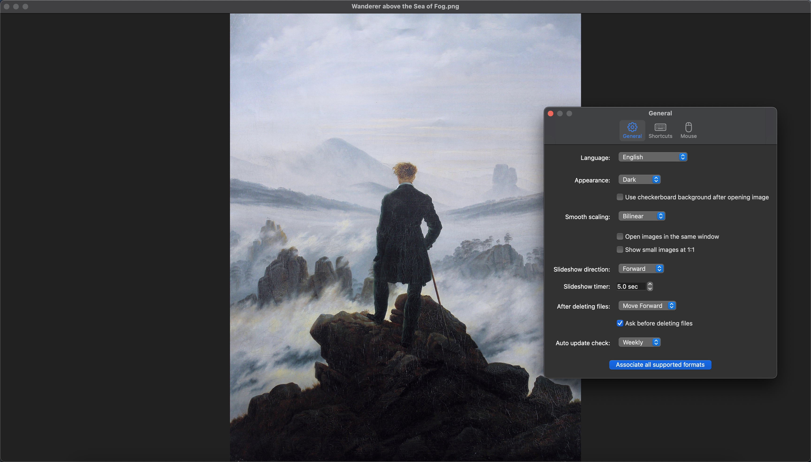
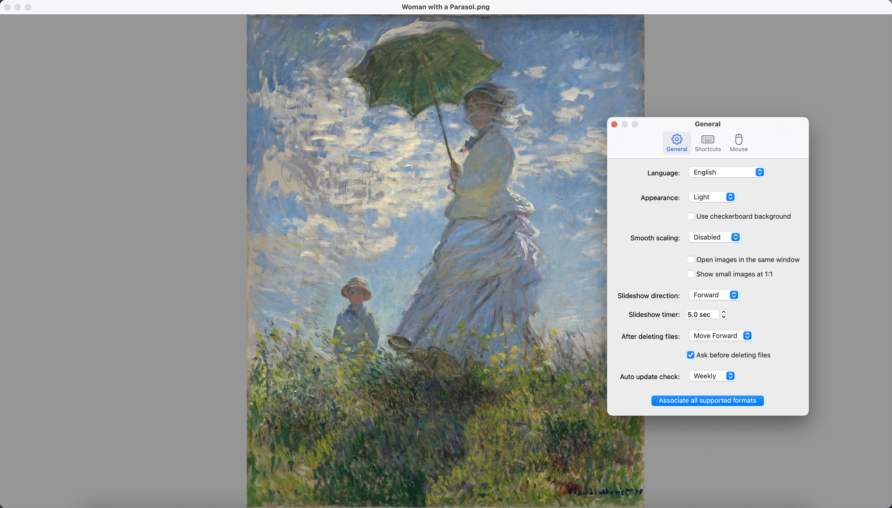

# Fovelle

Fovelle is a lightweight image viewer designed specifically for macOS. It is based on qView and keeps its focus on fast, minimal, and unobtrusive image viewing.

## Attribution

Fovelle incorporates portions of commits from [jdpurcell/qView](https://github.com/jdpurcell/qView) by jdpurcell.

## New Features

- **Added support for most common RAW image formats.**
- **Supports HDR rendering and display for both RAW and non-RAW image formats, with smooth, seamless adjustment for increasing or decreasing brightness.**
- Displays small images at their actual size (1:1).
- Supports both light and dark appearances.
- Press Esc to close the window or quit the app.
- Floating navigation buttons are displayed on the left and right sides of the window and automatically shown or hidden.
- Conditionally displays vertical and horizontal scrollbars.
- **Vector rendering for EPS and SVG, with zoom levels of up to 6400%.**
- EPS decoding uses the AGPL Ghostscript runtime bundled in release app bundles.

## Supported Formats

- Adobe Photoshop
- APNG
- Apple Icon
- ASTC Textures
- AVIF
- Canon CR2 RAW
- Canon CR3 RAW
- Canon CRW RAW
- Canon TIF RAW
- Compressed SVG
- DDS Textures
- DNG
- DxO RAW
- EPS
- Epson RAW
- Fuji RAW
- GIF
- HEIF
- HEIF Image Sequence
- Hasselblad 3FR RAW
- Hasselblad FFF RAW
- JPEG
- JPEG 2000
- JPEG XL
- KTX Textures
- Kodak RAW
- Leaf RAW
- Leica RAW
- Leica RWL RAW
- Minolta RAW
- Multiple Picture Object
- Nikon NEF RAW
- Nikon NEFX RAW
- Nikon NRW RAW
- OpenEXR
- Olympus ORF RAW
- Panasonic RAW
- Panasonic RW2 RAW
- Portable Bitmap
- Portable Graymap
- PNG
- Portable Pixmap
- PVRTC Textures
- Pentax RAW
- Phase One RAW
- Portable FloatMap
- QuickDraw Picture
- Radiance HDR
- Samsung RAW
- Silicon Graphics
- Sony ARW RAW
- Sony AXR RAW
- Sony SR2 RAW
- Sony SRF RAW
- SVG
- TGA
- TIFF
- WebP
- Windows Bitmap
- Windows Cursor
- Windows Icon
- X11 Bitmap
- X11 Pixmap

## Light Appearance

## Dark Appearance

